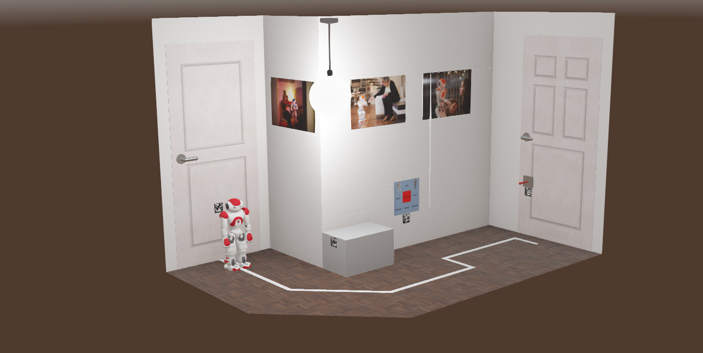
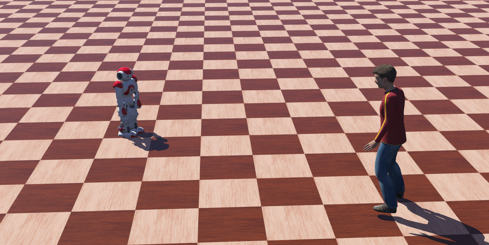
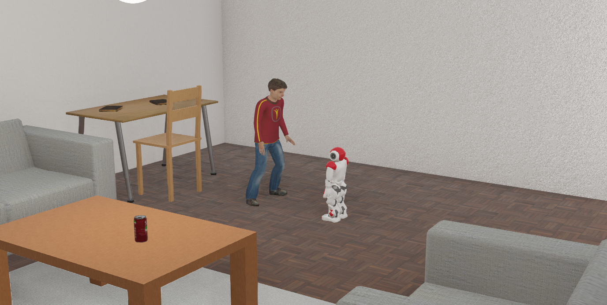

# Robotica Social
## Table of contents
* [Project description](#project-description)
* [Installation](#installation)
* [Usage](#usage)

## Project description
This repository contains different tools and code developed in Robot Operating System (ROS) that simulates a virtual robot NAO and different environments using Webots. In order to connect ROS to a Webots simulation a bridge that acts as controller is required. There are two ways to use ROS with Webots, using standard ROS controller or using a custom one. This project uses a custom controller, named ´nao_controller_node', that acts as a ROS node, providing all the simulated robot functions (sensors, motion control, animations, etc.) as topics or services to other ROS nodes.

The objective is to setup a simulation environment for the Social Robotics subject of Bachelor's Degree in Artificial Intelligence. 

Created in RSAIT robotics research group, Faculty of Computer Science, UPV/EHU, Basque Country.

## System Requirements
The recommended system requirements for running this project are the following:
- Operating system: Ubuntu 20.04 distribution.
- ROS version: Noetic (http://wiki.ros.org/noetic/Installation/Ubuntu)
- Python 3.
- Processor: 64-bit, dual-core or higher.
- RAM: 8 GB or more.
- Graphics card: OpenGL 4.0 or higher, with 1 GB of dedicated video RAM.
- Microphone and speakers.

## Installation
Follow these steps to install all the software required by this project:

### Webots
1. Download the Webots installer for Linux from the official website: https://cyberbotics.com/#download
2. Open a terminal and navigate to the directory where the installer file is located, and run:
```
sudo dpkg -i webots_2023a_amd64.deb
```
3. Follow the on-screen instructions to complete the installation process.
4. Set up the Webots environment variables by adding the following lines to your ~/.bashrc file:
```
export WEBOTS_HOME=/usr/local/webots
export LD_LIBRARY_PATH=$WEBOTS_HOME/lib/controller:$LD_LIBRARY_PATH
export PATH=$WEBOTS_HOME:$PATH
```
5. Once the installation is complete, open Webots from the start menu or from the command line: `webots`

Please note that Webots also requires the installation of some additional libraries, such as PyQt and ffmpeg. These libraries are automatically installed during the Webots installation process.

### Text-to-Speech
The ROS *speech* package contains a node for Text to Speech(TTS) capabilities that requires to install gTTS and VLC libraries:
```
pip3 install gTTS
sudo apt install vlc
```
### Speech Recognition
The ROS *speech* package contains a node for Automatic Speech Recognition (ASR) capabilities that requires to install install vosk, sounddevice and  portaudio tools
```
pip3 install vosk
pip3 install sounddevice
sudo apt-get install libportaudio2
```
## Usage
This project contains three simulated environments: an empty space with a flat surface, an empty corridor of a house, and a living room of a house. 

### Empty Corridor

The `empty_corridor.wbt` world contains an empty corridor of a house and the robot NAO placed next to a line drawn in the floor. The aim is to move the robot from one side of the corridor to the other giving voice commands.

Launch the `empty_corridor` world:
```
roslaunch nao_webots empty_corridor.launch
```
Launch the teleoperation node that controls the robot motion through speech commands:
```
roslaunch teleop_speech teleop_speech.launch
```
Try the following commands: "adelante", "atrás", "paso izquierda", "paso derecha", "giro izquierda", "giro derecha", "detener".

### Empty World Human

The `empty_world_human.wbt` world contains a flat surface, the NAO robot, and a human performing static body movements. The goal is to make the robot find the human (body and face) and approach him, stopping at an appropriate distance.

Launch the `empty_world_human` world:
```
roslaunch nao_webots empty_world_human.launch
```
Launch the people_perception package that includes a face detection node (face_detection.py) and a body detection (body_detection.py) node that use OpenCV library to find face and body in an image, and a people tracking node (people_tracking.py) that combines both those nodes to make the robot approach the human. NAO tracks with its face the human face, and moves according to the human position:
```
roslaunch people_tracking people_tracking.launch
```
Call to the find people service from the command line:
```
rosservice call /perception/find_people "data: true"
```
### Living Room Human

The `living_room_human.wbt` world contains a model of living room with several pieces of furniture, the robot NAO, and a human performing perform static body movements. The goal is to make the robot find the human (body and face) and approach him to start an interaction. NAO will approach the human, stopping at an appropriate distance, and once it founds him, will greet the person and ask if he wants to perform a taichi exercise.

This behavior is managed by the social_interaction package, a cognitive control node (cognitive_controller.py) executes the appropriate tasks according to the given command. It requires speech package for speech-based interaction capabilities and people_perception package for people perception. To launch the complete behavior:
```
roslaunch nao_webots living_room_human.launch
```
Launch the cognitive behavior:
```
roslaunch social_interaction social_interaction.launch
```
Now, try to say one of the following voice commands:
```
"buscar a antonio", "buscar antonio", "encuentra a antonio", "encuentra antonio", "encontrar a antonio", "encontrar antonio".
```
Once NAO is in front of the human and asks to perform a taichi activity, say: 
```
"sí estoy preparado" or "sí comencemos con la clase"
```
